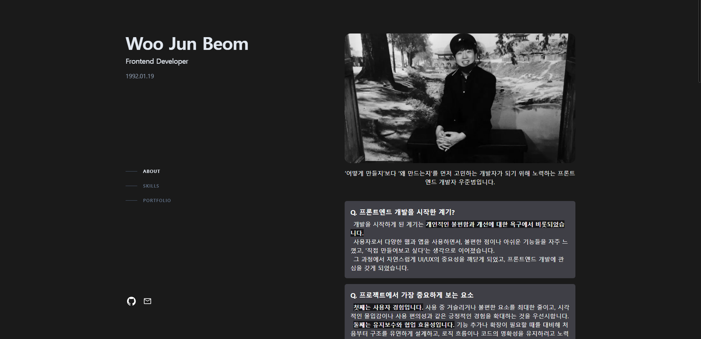
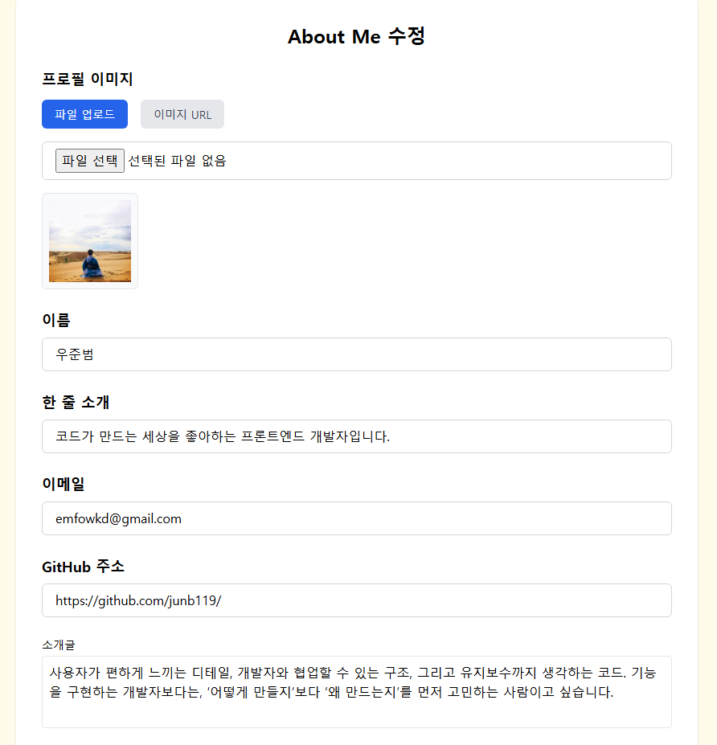
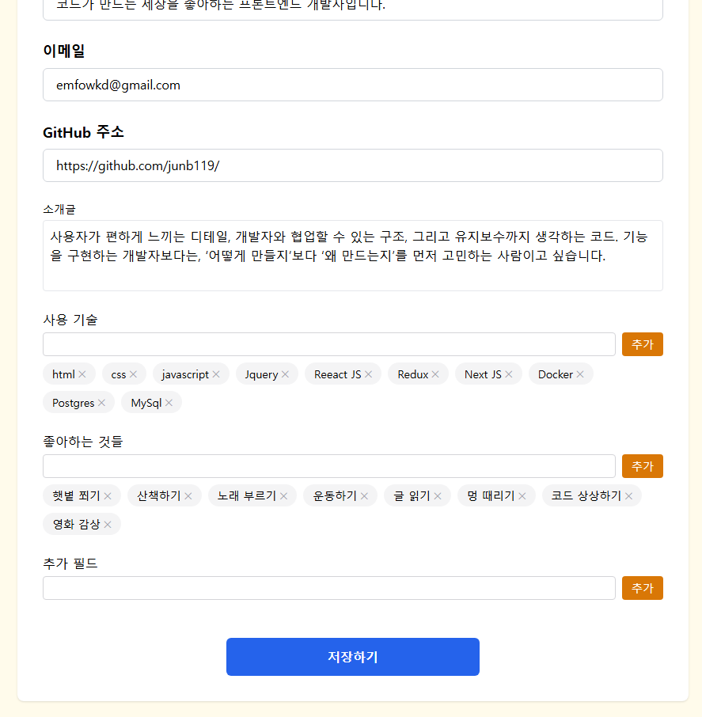
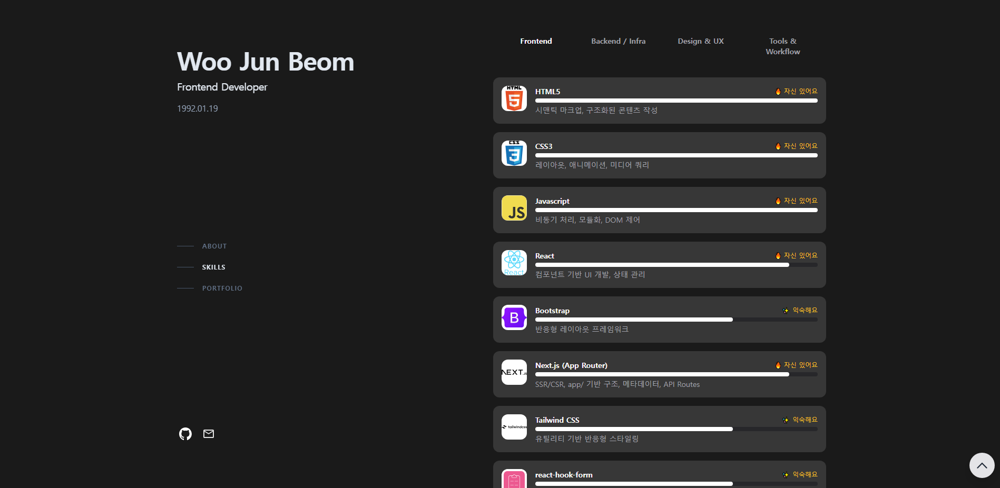
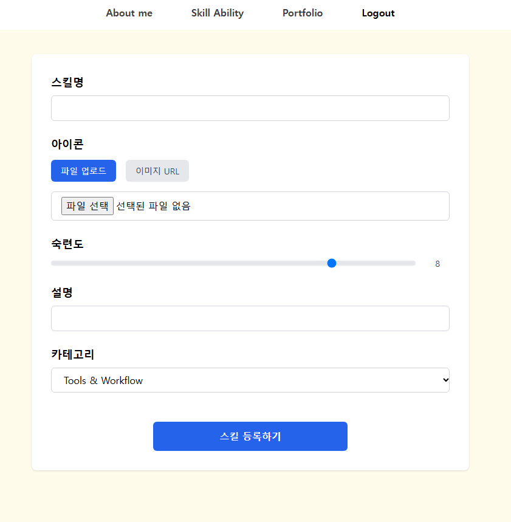
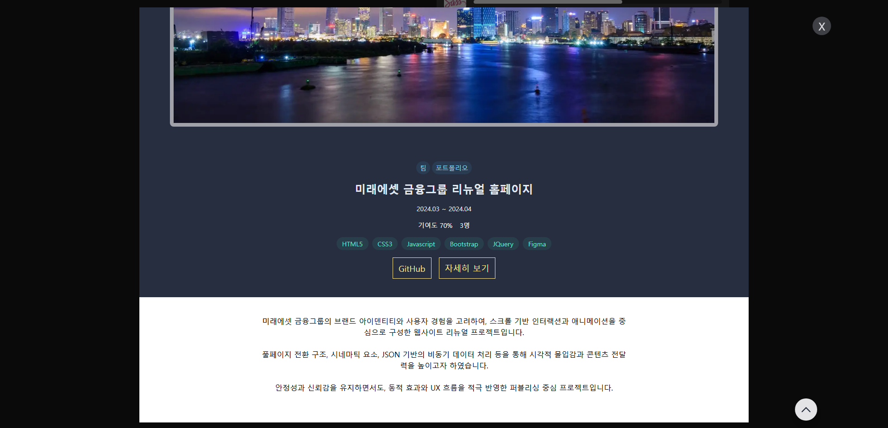
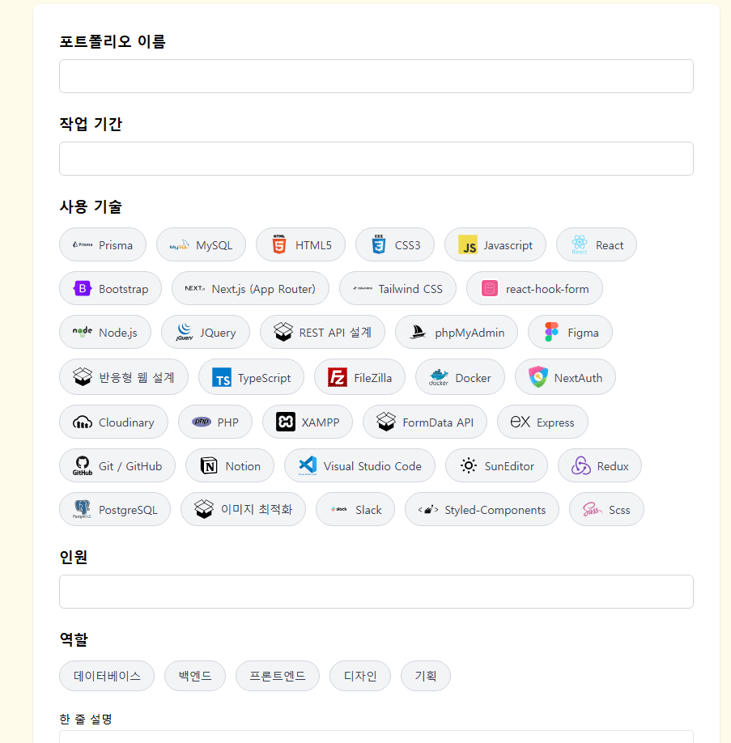
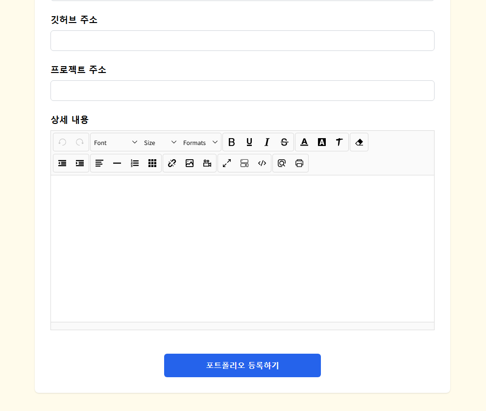

# 🧩 JunB’s 프로필 사이트

> **Next.js 기반으로 개발한 개인 포트폴리오 웹사이트입니다.**  
> 기획, 디자인, 개발, 배포까지 전 과정 1인 개발  
> 실제 운영 중인 사이트로, 인증 기반 CMS 기능까지 포함된 실전형 프로젝트입니다.

---

## 📅 프로젝트 개요

- **프로젝트명:** JunB’s 프로필 페이지
- **기간:** 2025.03 ~ 2025.04
- **인원:** 1명
- **역할:** 프론트엔드, 백엔드, 데이터베이스, 디자인, 기획

---

## 🔗 링크

- [🧑‍💻 GitHub Repository](https://github.com/junb119/myprofile_next_app2)
- [🖼️ Live Demo 보기](https://junbs-profile.vercel.app/)

---

## ⚙️ 사용 기술 (Tech Stack)

### Frontend
- Next.js (App Router)
- React, TypeScript
- Tailwind CSS
- React Hook Form

### Backend & Infra
- PostgreSQL + Prisma ORM
- NextAuth.js (Google OAuth)
- Supabase (배포 DB)
- Docker + docker-compose
- Next.js API Route

### Editor & 이미지 업로드
- SunEditor (에디터)
- Cloudinary (썸네일/에디터 이미지 업로드)

### Tools
- Figma (기획 및 디자인)
- Git / GitHub
- pgAdmin (로컬 DB 관리)

---

## 🧩 프로젝트 설명

이 프로젝트는 단순한 정적 소개 페이지를 넘어서,

- **Google 로그인 기반의 관리자 인증 시스템**
- **모든 콘텐츠 섹션(About / Skills / Portfolio)의 CRUD 기능**
- **Cloudinary 연동 이미지 저장**
- **SunEditor 기반 리치 콘텐츠 작성**
- **실제 배포 환경(Vercel + Supabase) 기반 구성**

등을 포함한 **CMS 구조의 포트폴리오 웹사이트**입니다.

---

## 🗺️ 주요 기능 요약

| 기능 | 설명 | 사용 기술 |
|------|------|-----------|
| 관리자 로그인 | Google 계정으로만 로그인 가능 | NextAuth.js, JWT 세션 |
| About 관리 | 소개글 및 프로필 이미지 수정 | Prisma, Cloudinary, 인증 체크 |
| Skills 관리 | 기술 스택 CRUD + 카테고리 필터 | Cloudinary, Tailwind, 다중 관계 모델 |
| Portfolio 관리 | 썸네일 + 상세 설명 + 이미지 포함 | Cloudinary, SunEditor, react-hook-form |
| 이미지 업로드 | 썸네일과 에디터 이미지 분리 업로드 | Cloudinary API, overwrite 전략 |
| 상세 모달 출력 | dangerouslySetInnerHTML로 HTML 렌더링 | Tailwind 기반 모달 UI |
| 데이터 마이그레이션 | 로컬 PostgreSQL → Supabase 전환 | Prisma CLI, SQL Dump |
| 개발환경 구성 | Docker 기반 환경 통합 관리 | Dockerfile, docker-compose.yml |
| 반응형 구현 | PC/모바일 대응 UI | Tailwind 유틸리티 기반 레이아웃 |

---

## 📂 주요 페이지 기능 설명

### 🧑 About 페이지
- 자기소개 및 프로필 이미지 출력
- 관리자만 수정 가능 (Google 로그인 기반)
- Cloudinary를 통해 이미지 저장 (secure_url 저장)
- 유효성 검사 및 중복 업로드 방지 UX 구현

### 🧠 Skill 페이지
- 기술 스택을 카테고리별로 구분하여 출력
- 아이콘, 숙련도, 설명 포함
- 페이지 접속 시 모든 스킬을 불러오고, 클라이언트에서 카테고리 필터링
- 관리자 전용 등록/수정/삭제 기능 포함

### 🧾 Portfolio 페이지
- 썸네일 + 설명 카드 리스트
- 상세 모달을 통해 프로젝트 세부 내용 렌더링
- SunEditor를 통한 이미지 포함 리치 콘텐츠 작성
- Cloudinary 연동 → base64 삽입 방지
- 수정/등록 시 업로드 중 중복 요청 방지 로직 포함

---

## 🚧 문제 인식 & 해결

1. **413 오류 (요청 용량 초과)**  
   → 이미지 업로드를 외부 저장소 Cloudinary로 전환하여 해결

2. **데이터 입출력 지연**  
   → React Query 등 캐시 전략 도입 예정, 구조 리팩토링 추진

3. **SSR / CSR 전략 혼용**  
   → 페이지 목적에 따라 SSR 적용 범위 재설정

4. **Cloudinary 리소스 낭비**  
   → `destroy API` 연동으로 불필요 이미지 정리 예정

5. **사용자 페이지의 시각적 흡입력 부족**  
   → 스크롤 애니메이션, 전환 효과 등 마이크로 인터랙션 추가 계획

---

## 📚 배운 점 (What I Learned)

- **App Router 중심의 Next.js 설계 및 구조화**
- **Prisma ORM과 SQL을 병행하여 데이터 모델링 경험 축적**
- **Cloudinary 이미지 업로드 로직 구성 및 성능 최적화**
- **인증/보안 기반의 보호 라우트 설계**
- **로컬 개발환경과 배포 환경의 차이를 체감하고 전략 수립**
- **UI/UX를 포함한 전체적인 웹 흐름에 대한 종합적 이해**

---

